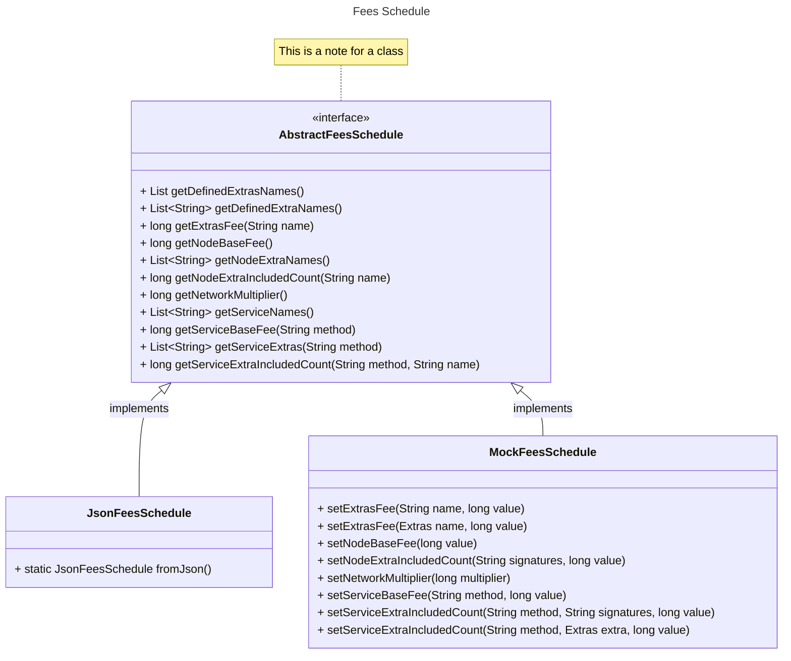

# Simple Fees Architecture

This is the architecture for simple fees aka. *Fees 2.0*.

The Fees schedule is defined by the AbstractFeesSchedule interface with two implementations, one to load the schedule
from JSON and the other one for unit testing using in-memory fees.

*AbstractFeesSchedule* defines methods to list all the extras and services by name, and to get the associated fees.

*JsonFeesSchedule* parses the [simple-fee-json](https://github.com/joshmarinacci/hiero-consensus-node/blob/simple-fees-research/hedera-node/hedera-app-spi/src/main/resources/simple-fee-schedule.json) file
using the [simple_fee_schedule.proto](https://github.com/joshmarinacci/hiero-consensus-node/blob/simple-fees-research/hapi/hedera-protobuf-java-api/src/main/proto/services/simple_fee_schedule.proto) protobuf.

*MockFeesSchedule* is used for unit testing. It provides an in-memory only empty fee schedule which can be populated using setter methods.

