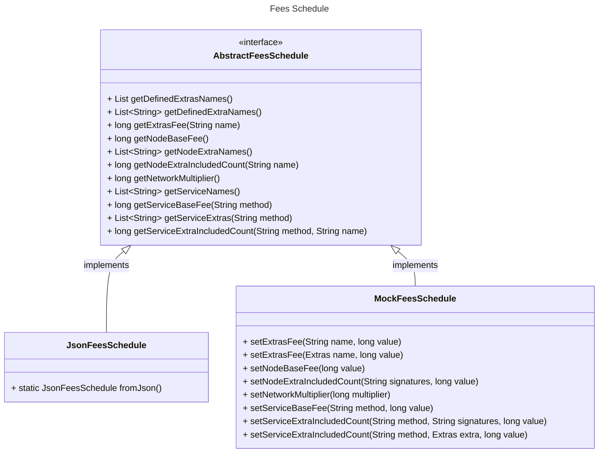
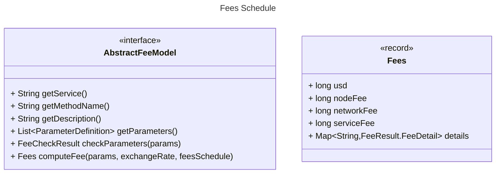

# Simple Fees Architecture

This is the architecture for simple fees aka. *Fees 2.0*.

## Fees Schedule

The Fees schedule is defined by the AbstractFeesSchedule interface with two implementations, one to load the schedule
from JSON and the other one for unit testing using in-memory fees.

[AbstractFeesSchedule](https://github.com/joshmarinacci/hiero-consensus-node/blob/simple-fees-research/hedera-node/hedera-app-spi/src/main/java/com/hedera/node/app/hapi/fees/AbstractFeesSchedule.java) defines methods to list all the extras and services by name, and to get the associated fees.

[JsonFeesSchedule](https://github.com/joshmarinacci/hiero-consensus-node/blob/simple-fees-research/hedera-node/hedera-app-spi/src/main/java/com/hedera/node/app/hapi/fees/JsonFeesSchedule.java) parses the [simple-fee-json](https://github.com/joshmarinacci/hiero-consensus-node/blob/simple-fees-research/hedera-node/hedera-app-spi/src/main/resources/simple-fee-schedule.json) file
using the [simple_fee_schedule.proto](https://github.com/joshmarinacci/hiero-consensus-node/blob/simple-fees-research/hapi/hedera-protobuf-java-api/src/main/proto/services/simple_fee_schedule.proto) protobuf.

[MockFeesSchedule](https://github.com/joshmarinacci/hiero-consensus-node/blob/simple-fees-research/hedera-node/hedera-app-spi/src/main/java/com/hedera/node/app/hapi/fees/MockFeesSchedule.java) is used for unit testing. It provides an in-memory only empty fee schedule which can be populated using setter methods.

## Fee Models

Every service transaction handler needs to calculate the fees for that service. To make these calculations easy to 
use outside of the actual Hedera Node project (ex: online fees estimator) the calculation logic is inside of a *fee 
model* and the fees given service are calculated using this model. For example the Consensus Service Submit Message 
fee is calculated using the *HCSSubmit* fee model.

The *AbstractFeeModel* abstract class defines the methods that all fee models must have.  The most important method
is `computeFee()` which computes the actual fee given a map of parameters, the current exchange rate, and a fee schedule.
It returns a `Fees` record which contains details of the fees plus the total in USD (tinycents), and the hbar split into
node, network, and service.

