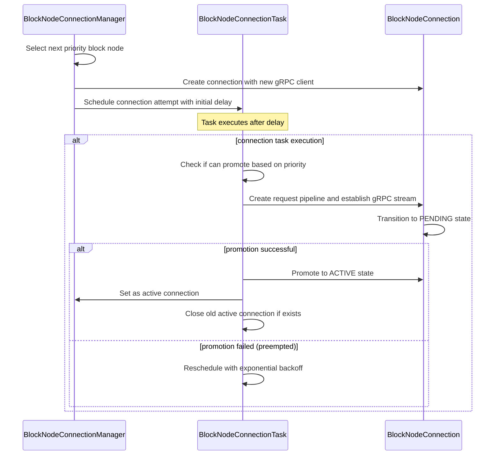
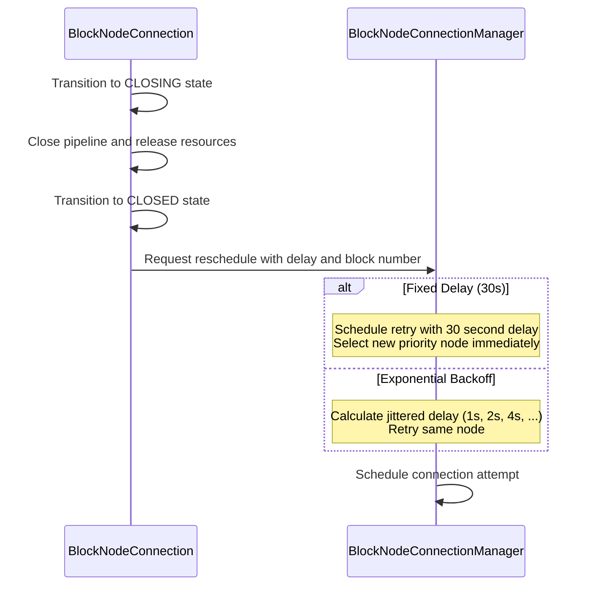
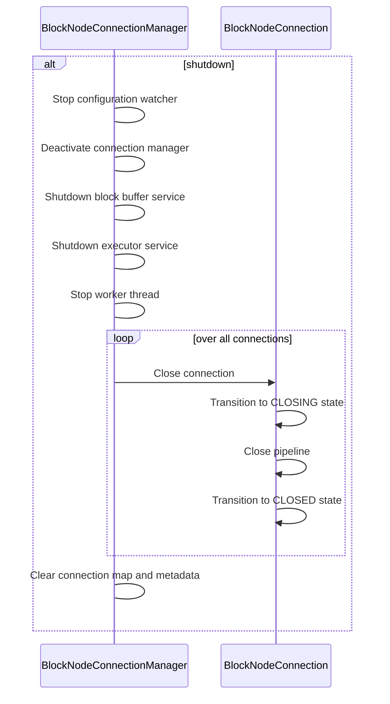

# Internal Design Document for BlockNodeConnectionManager

## Table of Contents

1. [Abstract](#abstract)
2. [Definitions](#definitions)
3. [Component Responsibilities](#component-responsibilities)
4. [Component Interaction](#component-interaction)
5. [Sequence Diagrams](#sequence-diagrams)
6. [Error Handling](#error-handling)

## Abstract

This document describes the internal design and responsibilities of the `BlockNodeConnectionManager` class.
This component manages active connections, handling connection lifecycle, and coordinating
with individual connection instances. There should be only one active connection at a time.
The class also interacts with the `BlockBufferService` to retrieve blocks/requests and notify the buffer of acknowledged
blocks.

## Definitions

<dl>
<dt>BlockNodeConnectionManager</dt>
<dd>The class responsible for managing and tracking all active block node connections, including creation, teardown, and error recovery.</dd>

<dt>BlockNodeConnection</dt>
<dd>A representation of a single connection to block node, managed by the connection manager.</dd>

<dt>BlockBufferService</dt>
<dd>The component responsible for maintaining a buffer of blocks produced by the consensus node.</dd>

<dt>Connection Lifecycle</dt>
<dd>The phases a connection undergoes.</dd>

<dt>RetryState</dt>
<dd>Tracks retry attempts and last retry time for each block node configuration. Persists across individual connection instances to maintain proper exponential backoff behavior.</dd>

<dt>BlockNodeStats</dt>
<dd>Maintains health and performance metrics for each block node including EndOfStream counts, block acknowledgement latency, and consecutive high-latency events.</dd>

<dt>Priority-based Selection</dt>
<dd>Algorithm for selecting the next block node to connect to based on configured priority values. Lower priority numbers indicate higher preference.</dd>
</dl>

## Component Responsibilities

- Maintain a registry of active connection instances.
- Track the latest verified block for each connection.
- Select the most appropriate connection for streaming blocks based on priority.
- Retry failed connections with exponential backoff (configurable multiplier and max delay).
- Track retry state and health statistics per node across connection lifecycles.
- Remove or replace failed connections.
- Support lifecycle control and dynamic configuration updates.

## Component Interaction

- Maintains a bidirectional association with each connection.
- Calls `BlockBufferService` to get the blocks/requests to send and to also notify the buffer when blocks are acknowledged.
- Updates connection state and retry schedule based on feedback from connections.

## Sequence Diagrams

### Connection Establishment

### Connection Error and Retry

### Shutdown Lifecycle

## Error Handling

- Implements backoff-based retry scheduling when connections fail.
- Detects and cleans up errored or stalled connections.
- If `getLastVerifiedBlock()` or other state is unavailable, logs warnings and may skip the connection.

### Retry and Exponential Backoff Mechanism

The connection manager implements two distinct retry strategies based on the type of failure:

#### Fixed Delay Retry

Used when the consensus node should immediately connect to a different block node:
- **Scenarios**: `SUCCESS`, `ERROR`, `PERSISTENCE_FAILED`, `UNKNOWN`, `BEHIND` (without block in buffer), EndOfStream rate limit exceeded
- **Delay**: Fixed 30 seconds
- **Behavior**: Failed node is rescheduled for retry while the manager immediately selects a new priority node

#### Exponential Backoff Retry

Used when retrying the same block node after transient issues:
- **Scenarios**: `TIMEOUT`, `DUPLICATE_BLOCK`, `BAD_BLOCK_PROOF`, `INVALID_REQUEST`, `BEHIND` (with block in buffer)
- **Initial Delay**: 1 second (`INITIAL_RETRY_DELAY`)
- **Multiplier**: 2x (`RETRY_BACKOFF_MULTIPLIER`)
- **Jitter**: Applied as `delay/2 + random(0, delay/2)` to spread out retry attempts and avoid multiple nodes retrying simultaneously
- **Max Backoff**: Configurable via `maxBackoffDelay` (defaults to 10 seconds)
- **Reset**: Retry count resets if no retry occurs within `protocolExpBackoffTimeframeReset` duration
- **Behavior**: Connection retries the same node without selecting a new one

#### Retry State Management

- `RetryState` tracks retry attempts and last retry time per node configuration
- State persists across individual connection instances
- Automatic reset of retry counter after configurable idle period
- Nodes are excluded from selection only while they have an active connection in the `connections` map
