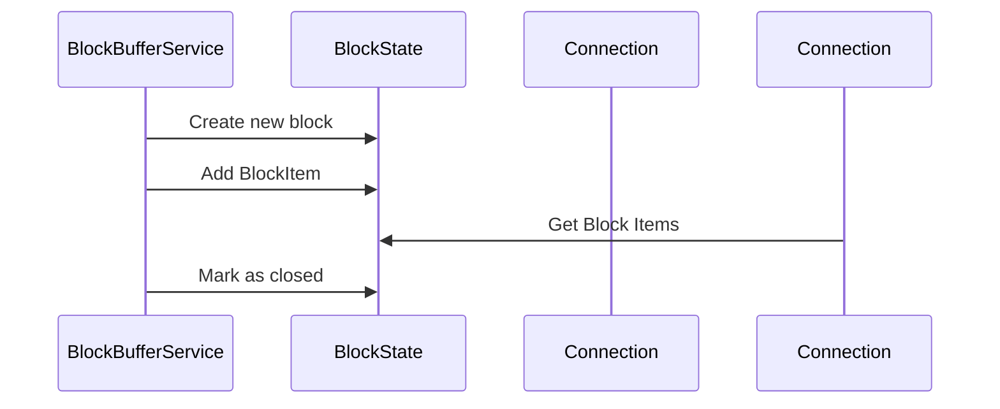
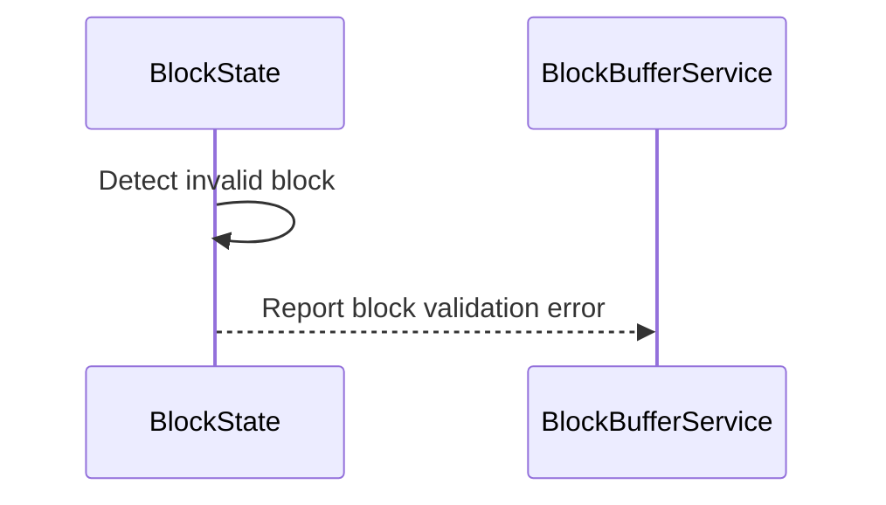

# BlockState.md

## Table of Contents

1. [Abstract](#abstract)
2. [Definitions](#definitions)
3. [Component Responsibilities](#component-responsibilities)
4. [Component Interaction](#component-interaction)
5. [Sequence Diagram](#sequence-diagram)
6. [Error Handling](#error-handling)

## Abstract

`BlockState` encapsulates the state of a single block created by the Consensus Node that is eventually sent to a Block
Node. This wrapper around the block data is used to associate items and requests to the block.

A block itself is made up of many items including, but not limited to: one block header, transactions, and one block
proof. These items will get batched into one or more requests that get sent to a Block Node.

## Definitions

<dl>
<dt>BlockItem</dt> <dd>An individual unit of work or data associated with a block, to be streamed to downstream systems.</dd>
</dl>

## Component Responsibilities

- Maintain the block number this instance represents.
- Store all BlockItems associated with the block.
- Record the timestamp when the block is considered closed/completed.
- Expose read-only access to block contents and state.

## Component Interaction

- Passed into streaming pipelines that require access to individual block data.
- Supplies request metadata to connections for stream transmission.
- Used to create streamable requests.

## Sequence Diagram

## Error Handling

- Item's cannot be added to a closed block.

