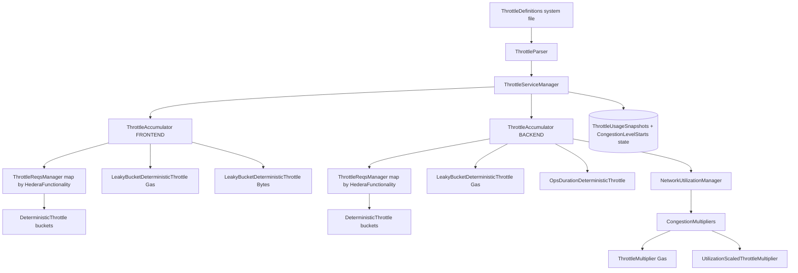
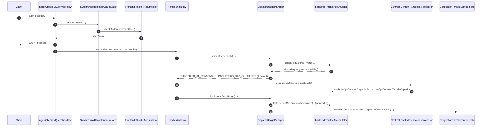
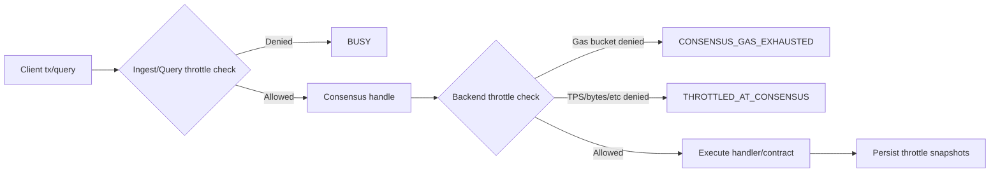

# Throttles

This document explains how throttling is organized in `hedera-services`, where each class fits, and how a transaction
flows through the throttle system.

## Scope

This page focuses on Hedera application throttling in:

- `hedera-node/hapi-utils/.../throttles` (core bucket primitives)
- `hedera-node/hedera-app/.../throttle` (runtime orchestration and enforcement)
- `hedera-node/hedera-app/.../fees/congestion` (congestion multipliers)

It does **not** cover unrelated throttles in `platform-sdk` (for example stream/reconnect/log rate-limiting).

## High-Level Model

Hedera uses leaky-bucket throttles with deterministic time progression.

- A transaction can map to one or more throttle buckets.
- The transaction is allowed only if **all required buckets** have capacity.
- There are separate runtime throttle contexts, modeled by `ThrottleAccumulator.ThrottleType`:

1. **Frontend (`FRONTEND_THROTTLE`):** per-node admission control at ingest/query.
2. **Backend (`BACKEND_THROTTLE`):** network-deterministic usage and congestion accounting at consensus.
3. **No-op (`NOOP_THROTTLE`):** disables all `checkAndEnforceThrottle` decisions and reports
   `Long.MAX_VALUE` capacity. Selected by `StandaloneModule` / `TransactionExecutors` when
   their `disableThrottling` flag is set (e.g. for transaction replay and other standalone
   executor scenarios).

In addition to TPS-style buckets, there are specialized throttles for:

- EVM gas per second
- Jumbo transaction excess bytes per second
- Contract EVM ops-duration units

## Code Organization

### 1) Core primitives (`hapi-utils`)

- `DiscreteLeakyBucket`: Raw used/capacity bucket with leak and consume operations.
- `BucketThrottle` : TPS/MTPS leaky-bucket arithmetic (capacity units per tx, leak-by-elapsed-nanos).
- `DeterministicThrottle` : Wraps `BucketThrottle` with monotonic `Instant` decisions and snapshots.
- `LeakyBucketThrottle` + `LeakyBucketDeterministicThrottle`: Generic scalar limiter used for gas/bytes style limits.
- `OpsDurationDeterministicThrottle` : Contract execution "ops duration" limiter with configured capacity and leak rate.
- `CongestibleThrottle` : Common read surface (`used`, `capacity`, `mtps`, `name`, `instantaneousPercentUsed`) used by congestion pricing.

### 2) Definitions and mapping

- `ThrottleParser` validates and parses uploaded system-file bytes
- Logical mapping:
  - `ThrottleBucket` (domain model) turns groups into:
    - a `DeterministicThrottle` bucket instance, and
    - per-function operation requirements
- `ThrottleReqsManager` enforces "all required bucket claims must pass"

### 3) Runtime enforcement

- `ThrottleAccumulator` (core runtime engine) : Holds two function→requirements maps (normal
  and high-volume; see [High-Volume Buckets](#high-volume-buckets-hip-1313)) plus specialized
  throttles (gas/bytes/ops-duration), and performs allow/deny decisions.
- `SynchronizedThrottleAccumulator` : Thread-safe wrapper used by ingest/query workflows.
- `ThrottleServiceManager` : Lifecycle orchestrator. Owns the init / rebuild / refresh path for
  the gas, bytes, and ops-duration configuration; persists and restores `CongestionThrottleService`
  snapshots (with an unconditional reset variant used during dispatch screening); reclaims
  frontend capacity on failed implicit creates / auto-associates; and refreshes throttle metric
  gauges. It does **not** read system files itself — it accepts already-decoded `Bytes` and uses
  `ThrottleParser` to deserialize them. See `ThrottleServiceManager.java` for the current method
  set and contracts.
- `NetworkUtilizationManagerImpl` : Backend/consensus tracking entrypoint used by handle workflow.

## Component Diagram

## Transaction Flow Diagram

## Quick Reference Diagram

## Frontend vs Backend Summary

- Frontend (`ThrottleType.FRONTEND_THROTTLE`)
  - Used at ingest/query precheck time.
  - Capacity split by number of nodes.
  - Returns precheck-style throttling (`BUSY`).
  - Thread-safe access via `SynchronizedThrottleAccumulator`.
- Backend (`ThrottleType.BACKEND_THROTTLE`)
  - Used during handle/consensus.
  - Deterministic tracking for congestion and state snapshots.
  - Produces consensus throttle outcomes (`THROTTLED_AT_CONSENSUS`, `CONSENSUS_GAS_EXHAUSTED`).
  - Drives congestion multipliers.

## Specialized Throttles

- Gas throttle
  - Enforced for contract operations when enabled.
  - Config in `ContractsConfig`:
    - `contracts.maxGasPerSec` (frontend)
    - `contracts.maxGasPerSecBackend` (backend)
    - `contracts.throttle.throttleByGas`
- Bytes throttle (jumbo tx)
  - **Frontend-only.** The bytes throttle is configured on the ingest accumulator; the backend
    handle path does not enforce an excess-bytes ceiling.
  - Enforced on excess bytes for configured functionalities.
  - Config in `JumboTransactionsConfig`:
    - `jumboTransactions.maxBytesPerSec`
    - `jumboTransactions.isEnabled`
- Ops-duration throttle (contracts)
  - Enforced in contract execution path via `ThrottleAdviser`.
  - Config in `ContractsConfig`:
    - `contracts.opsDurationThrottleCapacity`
    - `contracts.opsDurationThrottleUnitsFreedPerSecond`
    - `contracts.throttle.throttleByOpsDuration`

## High-Volume Buckets (HIP-1313)

`ThrottleAccumulator` carries two parallel `HederaFunctionality → requirements` maps: one for
normal-volume buckets and one for high-volume buckets. Both are rebuilt from the active
`ThrottleDefinitions` and both contribute to the persisted snapshot list.

High-volume utilization is surfaced to fee-charging handlers through `ThrottleAdviser` (a
basis-points reading per functionality). Handlers use that reading to apply HIP-1313 pricing
tiers. Crucially, the high-volume map does **not** drive admission decisions — allow/deny
remain governed entirely by the normal-volume map.

## State and Recovery

Throttle state is persisted by `CongestionThrottleService` as two singletons:

- A snapshot of TPS bucket usage plus the gas and ops-duration throttle usage
  (`ThrottleUsageSnapshots`).
- The most-recent timestamps at which each congestion-pricing level started, for both the
  generic (entity-utilization) and gas-utilization multipliers (`CongestionLevelStarts`).

At genesis these singletons are initialized to their proto defaults. On startup or reconnect,
`ThrottleServiceManager` applies configuration, rebuilds bucket throttles from the active
`ThrottleDefinitions`, resets congestion multiplier expectations, and (when not at genesis)
rehydrates both singletons.

The snapshot restore is **size-matched** against the active throttle list. When the persisted
TPS list is shorter than the rebuilt set, the restore falls back to the normal-only throttle
list — the backwards-compatibility path for state saved before high-volume buckets existed. If
no size matches, the restore is silently skipped and the rebuilt throttles keep their zero
usage.

### Snapshot ordering

The persisted TPS snapshot list is positional. Its order must match the iteration order of the
active throttle list at restore time. Size mismatches are detected but index alignment is
implicit — adding, removing, or reordering buckets requires care because there is no symbolic
binding between a snapshot entry and the throttle it belongs to.

### Null vs. EPOCH encoding for congestion-level starts

The in-memory multiplier representation uses `null` `Instant` to mean "this congestion level
has not started at the current consensus time." Because proto cannot store `null`, the unset
case is encoded as the UNIX epoch (`1970-01-01T00:00:00Z`) on write and decoded back to `null`
on read. Treat the epoch in `CongestionLevelStarts` as a sentinel for "unset," not a real
start time.

### Dispatch-time persistence

Before a dispatch is run, `DispatchUsageManager` resets the backend throttles to their last
saved usage (so child-dispatch attempts under a failed parent do not double-count) and
triggers the backend throttle check, raising a throttle exception that maps to
`CONSENSUS_GAS_EXHAUSTED` or `THROTTLED_AT_CONSENSUS` on denial.

After the dispatch, it credits back unused gas for contract operations, reclaims frontend
capacity on non-success user dispatches whose failed implicit creations or auto-associations
originally consumed it on *this* node, and persists the updated snapshots and
congestion-level starts. See `DispatchUsageManager` for the exact entry points.

## Schedule Throttle (HSS)

The Hedera Schedule Service uses a **separate** throttle (`ScheduleThrottle`, built via
`AppScheduleThrottleFactory`) to gate transactions scheduled for future execution. Differences
from the main runtime throttle:

- It runs on a private `ThrottleAccumulator` instance configured from the active throttle
  definitions, independent of the ingest and backend accumulators.
- Its persistence is owned by HSS (per scheduled second), not by `CongestionThrottleService`.
- It exposes an `allow` predicate (returns `true` when capacity is reserved), the opposite
  polarity of the runtime `checkAndEnforceThrottle` (returns `true` when *throttled*).

## Status Mapping

This table maps common throttle-related statuses to the exact decision point where they are emitted.

|          Status           |    Emitted in phase     |                                   Decision point                                    |            Source path             |
|---------------------------|-------------------------|-------------------------------------------------------------------------------------|------------------------------------|
| `BUSY`                    | Ingest precheck         | `synchronizedThrottleAccumulator.shouldThrottle(txInfo, ...)` returns true          | `IngestChecker.java`               |
| `BUSY`                    | Query handling precheck | `synchronizedThrottleAccumulator.shouldThrottle(function, query, ...)` returns true | `QueryWorkflowImpl.java`           |
| `CONSENSUS_GAS_EXHAUSTED` | Handle/consensus        | Backend check failed and last tx was gas-throttled (`wasLastTxnGasThrottled()`)     | `DispatchUsageManager.java`        |
| `THROTTLED_AT_CONSENSUS`  | Handle/consensus        | Backend check failed for non-gas reason                                             | `DispatchUsageManager.java`        |
| `CONSENSUS_GAS_EXHAUSTED` | Contract execution path | Ops-duration throttle had zero available capacity before EVM execution              | `ContextTransactionProcessor.java` |

**SEE ALSO:**
- [High-Volume Pricing (HIP-1313)](high-volume-pricing.md)
- [Steady-state throttling test suite](state-throttling-tests.md) — the `STATE_THROTTLING` CI suite.

**NEXT: [Workflows](workflows.md)**
